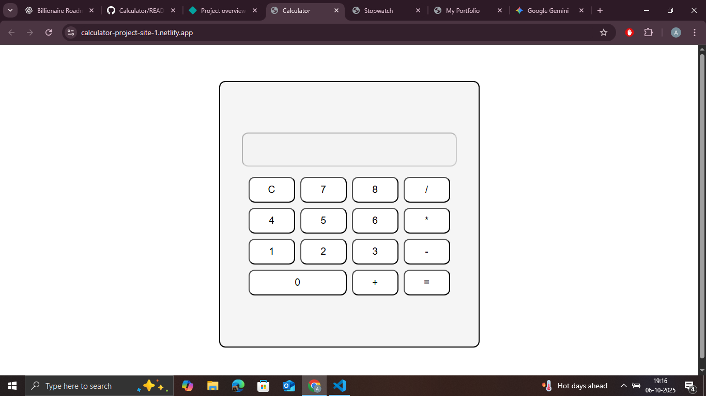

# 🧮 Calculator App

A sleek and responsive **Calculator App** built using **HTML, CSS, and JavaScript**.  
It performs basic arithmetic operations with a smooth user interface and responsive design suitable for all devices.

## 🌟 Features
- Perform addition, subtraction, multiplication, and division  
- Clear and Delete functionality  
- Fully responsive layout  
- Keyboard support (optional, if added)  

## 🧰 Tech Stack
- HTML  
- CSS  
- JavaScript  

## 🚀 Live Demo
[👉 View on Netlify](https://calculator-project-site-1.netlify.app/)

## 📸 Screenshot

